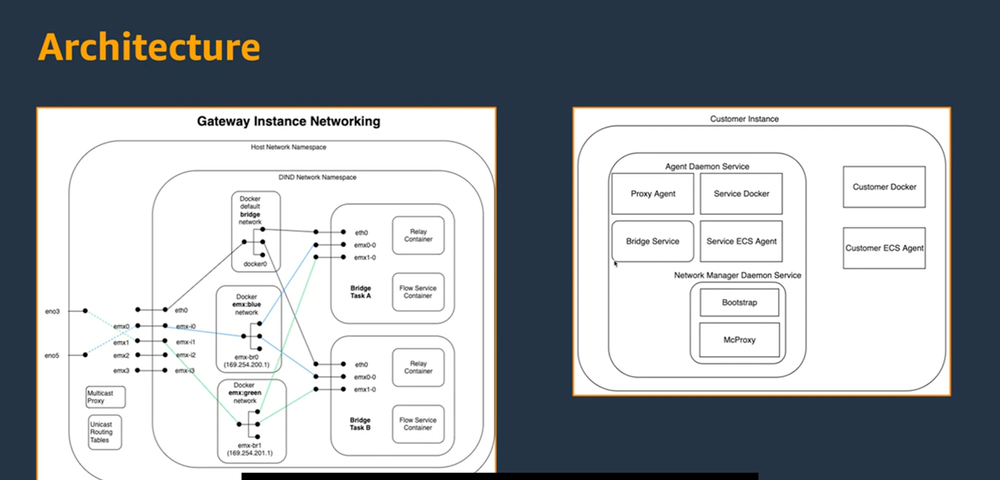
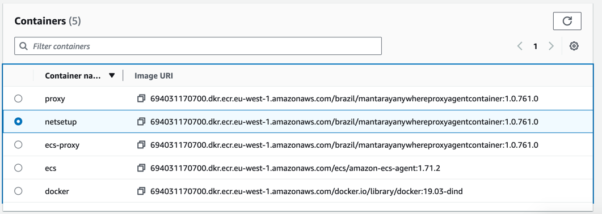
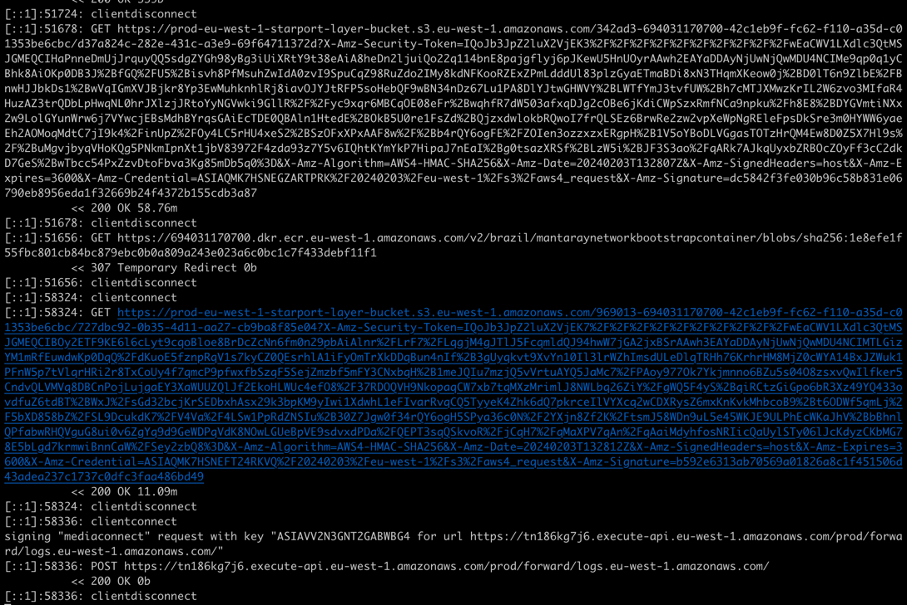
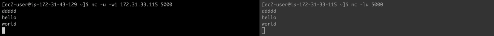
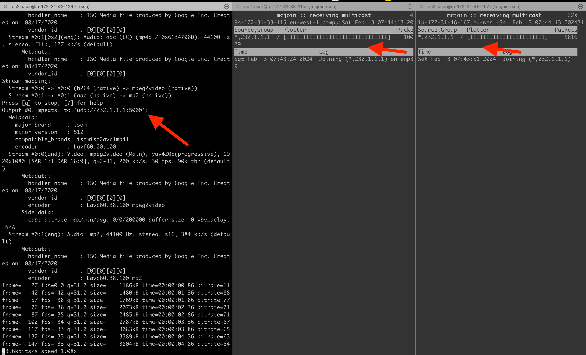

# MediaConnect Cloud-to-Ground

[Blog](https://aws.amazon.com/blogs/media/connect-your-on-premises-multicast-video-network-to-the-cloud-with-aws-elemental-mediaconnect-gateway/)

> 如此负载的架构



查看这个视频 -- 好好学习 -- https://broadcast.amazon.com/videos/825157

[博客 多播地址在Transit Gateway的使用](https://aws.amazon.com/blogs/networking-and-content-delivery/integrating-external-multicast-services-with-aws/)

### instance内的容器

| image | container | c |
| --- | --- | --- | --- |
| 694031170700.dkr.ecr.eu-west-1.amazonaws.com/ecs/amazon-ecs-agent:1.71.2 |||
|||proxyagent.sh|内容参考文件 [proxyagent.sh](./proxyagent.sh) |


```bash
#!/bin/bash

## Amazon Web Services, Inc. or its affiliates
## Confidential Strictly Private
##
## ---------------------------------------------------------------------------
##          COPYRIGHT NOTICE
## ---------------------------------------------------------------------------
## Copyright 2023, Amazon Web Services, Inc. or its affiliates. All rights reserved.
##
## Amazon Web Services or its affiliates owns the sole copyright to this software.
## Under international copyright laws you (1) may not make a copy of this software
## except for the purposes of maintaining a single archive copy, (2) may not
## derive works herefrom, (3) may not distribute this work to others. These
## rights are provided for information clarification, other restrictions of
## rights may apply as well.
##
## This is an unpublished work.
## ---------------------------------------------------------------------------
## WARRANTY
## ---------------------------------------------------------------------------
## Amazon Web Services, Inc. or its affiliates MAKES NO WARRANTY OF ANY KIND WITH REGARD TO THE USE OF ## THIS SOFTWARE, EITHER EXPRESSED OR IMPLIED,INCLUDING, BUT NOT LIMITED TO, THE IMPLIED WARRANTIES OF ## MERCHANTABILITY OR FITNESS FOR A PARTICULAR PURPOSE. FOR MORE INFORMATION CONSULT THE AWS ELEMENTAL ## END USER LICENSE AGREEMENT: https://aws.amazon.com/legal/elemental-appliances-software-eula/
## ---------------------------------------------------------------------------

ADDONS=/opt/amazon/httpproxy/addons
# Delete the cert on start since it has a max of 3 years lifetime, recreated on start
rm -f /home/httpproxy/.mitmproxy/*

# If this is the proxy for the agents (not for a bridge), then enter the aws-elemental network namespace which is what
# we use for the DIND container so that the bridges continue to run even if it exits.
enter=""
if [[ -z "$ELEMENTAL_ANYWHERE_TASK_ARN" && -z "$INSTANCE_LEVEL_AGENT" ]]; then
    enter="nsenter --net=/hostnetns/aws-elemental"
    pid=$$
    duration=1003d  # About 2.75 years since 3 non-leap years is 1095 days.
    (sleep $duration && kill $pid) &
fi
$enter /opt/amazon/bin/httpproxy -s $ADDONS/redirect.py -s $ADDONS/redirect-websocket.py -s $ADDONS/sigv4.py "$@"
```

日志查看




```log
[ec2-user@ip-172-31-43-129 ~]$ curl --proto "https" -o "/tmp/ecs-anywhere-install.sh" "https://amazon-ecs-agent.s3.amazonaws.com/ecs-anywhere-install-latest.sh" && sudo bash -c 'mkdir -p /etc/ecs && echo ECS_INSTANCE_ATTRIBUTES={\"gateway_arn\": \"arn:aws:mediaconnect:eu-west-1:390468416359:gateway:1-WFYAVlMNUgFUXQgK-b84e6d4a9106:multicast-demogateway\"} > /etc/ecs/ecs.config && source /tmp/ecs-anywhere-install.sh --region "eu-west-1" --cluster "MediaConnectGateway" --activation-id "c99bf366-4eb9-4a20-8895-7fa4905df793" --activation-code "p96bCvH7grvYORNt8QBS"'
  % Total    % Received % Xferd  Average Speed   Time    Time     Time  Current
                                 Dload  Upload   Total   Spent    Left  Speed
100 21510  100 21510    0     0  58935      0 --:--:-- --:--:-- --:--:-- 59093
Running ECS install script on amzn 2023
###

Last metadata expiration check: 3:45:57 ago on Fri Feb  2 11:37:53 2024.
Package jq-1.6-10.amzn2023.0.2.x86_64 is already installed.
Dependencies resolved.
Nothing to do.
Complete!

##########################
# Trying to install ssm agent ...

SSM agent is already installed.

##########################
# Trying to Register SSM agent ...

SSM agent is already registered. Managed instance ID: mi-017f3e52a1bb17489

# ok
##########################


# ok
##########################

docker is already installed, skipping installation
Copying certs for exec feature
Using /etc/ssl/certs/ca-certificates.crt
/etc/ssl/certs/ca-certificates.crt: OK

# ok
##########################

Downloading SSM binaries for exec feature
  % Total    % Received % Xferd  Average Speed   Time    Time     Time  Current
                                 Dload  Upload   Total   Spent    Left  Speed
100 31.0M  100 31.0M    0     0  61.6M      0 --:--:-- --:--:-- --:--:-- 61.6M
amazon-ssm-agent
ssm-agent-worker
ssm-document-worker
ssm-session-worker
ssm-session-logger
ssm-cli

# ok
##########################


##########################
# Trying to install ecs agent ...


##########################
# Trying to verify the signature of amazon-ecs-init package ...

/usr/bin/gpg
gpg: key BCE9D9A42D51784F: 1 signature not checked due to a missing key
gpg: key BCE9D9A42D51784F: "Amazon ECS <ecs-security@amazon.com>" not changed
gpg: Total number processed: 1
gpg:              unchanged: 1
gpg: Signature made Tue Jan  9 23:54:53 2024 UTC
gpg:                using RSA key 50DECCC4710E61AF
gpg: Good signature from "Amazon ECS <ecs-security@amazon.com>" [unknown]
gpg: WARNING: Using untrusted key!
amazon-ecs-init GPG verification passed. Install amazon-ecs-init.

# ok
##########################

Last metadata expiration check: 3:45:59 ago on Fri Feb  2 11:37:53 2024.
Dependencies resolved.
=============================================================================================================
 Package                       Architecture         Version                 Repository                  Size
=============================================================================================================
Installing:
 amazon-ecs-init               x86_64               1.80.0-1                @commandline                27 M

Transaction Summary
=============================================================================================================
Install  1 Package

Total size: 27 M
Installed size: 98 M
Downloading Packages:
Running transaction check
Transaction check succeeded.
Running transaction test
Transaction test succeeded.
Running transaction
  Preparing        :                                                                                     1/1
  Installing       : amazon-ecs-init-1.80.0-1.x86_64                                                     1/1
  Running scriptlet: amazon-ecs-init-1.80.0-1.x86_64                                                     1/1
  Verifying        : amazon-ecs-init-1.80.0-1.x86_64                                                     1/1

Installed:
  amazon-ecs-init-1.80.0-1.x86_64

Complete!
/etc/ecs/ecs.config already exists, preserving existing config and appending cluster name.
Created symlink /etc/systemd/system/multi-user.target.wants/ecs.service → /usr/lib/systemd/system/ecs.service.

# ok
##########################


##########################
# Trying to wait for ECS agent to start ...

Ping ECS Agent registered successfully! Container instance arn: "arn:aws:ecs:eu-west-1:390468416359:container-instance/MediaConnectGateway/95cc1024aa1f47ac9bc50305c4ddcced"

You can check your ECS cluster here https://console.aws.amazon.com/ecs/home?region=eu-west-1#/clusters/MediaConnectGateway

# ok
##########################


##########################
This script installed three open source packages that all use Apache License 2.0.
You can view their license information here:
  - ECS Agent https://github.com/aws/amazon-ecs-agent/blob/master/LICENSE
  - SSM Agent https://github.com/aws/amazon-ssm-agent/blob/master/LICENSE
  - Docker engine https://github.com/moby/moby/blob/master/LICENSE
##########################
```

### ffmpeg 推UDP流

ffmpeg -re -i file.mp4 -f mpegts udp://232.1.1.1:5000

[Github Transit Gateway Multicast向导和库](https://github.com/flabat/aws-multicast-demo)

### 最好的测试方法

```bash
# 来自于GitHub库的安装方法
mcjoin -s 232.1.1.1

mcjoin -j 232.1.1.1

```

```bash
sudo yum install nc
#先测试安全组和NCL，确保unicat udp包是OK的

#发送端
nc -u -w1 172.31.33.115 5000

#接收端
nc -lu 500
```



#### 结合 ffmpeg and mcjoin来接收



代码

```python

import socket
import struct

MCAST_GRP = '232.1.1.1'
MCAST_PORT = 5000

sock = socket.socket(socket.AF_INET, socket.SOCK_DGRAM, socket.IPPROTO_UDP)
sock.bind((MCAST_GRP, MCAST_PORT))
mreq = struct.pack("4sl", socket.inet_aton(MCAST_GRP), socket.INADDR_ANY)
sock.setsockopt(socket.IPPROTO_IP, socket.IP_ADD_MEMBERSHIP, mreq)

with open('sample.mp4', 'wb') as f:
    try:
        while True:
            data, addr = sock.recvfrom(1024)
            f.write(data)
    except KeyboardInterrupt:
        pass

```